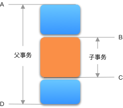

# spring 事务

## 事务传播行为

场景：用户购物结账。选择一个或者多个物品，然后到收银处结账。

可能涉及到的事务：

1. 减库存：商品库存足量
2. 账户扣款：用户有足够的余额购买商品
3. 用户买单：扣款成功+减库存成功才能算买单成功

```puml
买单 --> 减库存
    --> 扣款
```

账户初始信息：

商品信息：

| id | name | price | num |
|--- | ---  | ----- | --- |
| 1  | a    | 6.5  |  10 |
| 2  | b    | 66.8  |  20 |

账户信息：

| id | name | account_balance |
|--- | ---  | --------------- | 
| 1  | hgf  |       100       |

### REQUIRED

如果是立即购买，

tx(买单)中包含两个方法：

1. 减库存
2. 扣款

减库存和扣款这两个操作，只要有一个发生异常，那么就会造成买单失败。需要回滚。
此时只需要一个事务即可。子操作不需要开启额外的事务，但是也必须在当前事务中进行。

异常情况1：购买商品a 20件，客户账户有足够的钱付款，可是库存不足20件，会造成买单失败，事务回滚。既不会扣账户钱，也不会减库存。
异常情况2：购买商品b 2件，库存足够，但是账户余额不足，买单失败，事务回滚。既不会扣账户钱，也不会减库存。


正常情况：购买商品a 2件，库存足够，账户余额足够，买单成功，事务提交。扣账户钱，减库存。


### REQUIRED_NEW

但可能会有这样一种场景，客户在扣款过程中出现了一点麻烦，可以先扣库存，为用户预留商品，等待付款。但是如果客户一段时间没付款，则商品重新回仓库。

所以此时，如图：


tx(买单)分为：

1. tx(减库存)此事务的传播设为`REQUIRED_NEW`
2. tx(扣款)

减库存在自己的事务中运行，不管扣款是否成功，只要减库存的过程中正常，就会给客人留下商品。


情况1：库存不足，账户余额充足；此时`tx(减库存)`事务失败，此时`tx(减库存)`会回滚，由于`storeDecr()`抛出了mysql的异常（期望mysql usigned int类型为负数，导致`com.mysql.cj.jdbc.exceptions.MysqlDataTruncation`），`tx(买单)`也会回滚。

> 假设`tx(减库存)`异常没有传递到`tx(买单)`，`tx(买单)`会回滚吗？
> 可以将`storeDecr()`使用`try catch`封起来。此时`tx(减库存)`回滚，但是`tx(买单)`不会回滚。
> 即：**子事务`Propagation.REQUIRES_NEW`，子事务发生回滚，不必然导致父事务回滚。除非子事务的异常对父事务可见，造成父事务区间发生异常，父事务回滚**

情况2：库存充足，账户余额不足；此时由于先执行`tx(扣款)`且失败回滚，并不会执行`tx(减库存)`，`tx(买单)`也会回滚。

> 假设先执行`tx(减库存)`，然后执行`tx(扣款)`，由于`tx(扣款)`回滚会导致`tx(减库存)`回滚吗？
> `tx(减库存)`提交成功，不会回滚。`tx(扣款)`和`tx(买单)`属于同一事务，会回滚。


情况3：库存和账户余额均满足：此时成功。


说一为了满足为用户预留商品，不因为用户当前扣款失败就让出库存，可以将`tx(减库存)`propagation设置为`REQUIRED_NEW`，且代码逻辑顺序上先于`tx(扣款)`。

## 总结

### 嵌套事务



1. 需要事务BC与事务AD一起commit，即：作为事务AD的子事务，事务BC只有在事务AD成功commit时（阶段3成功）才commit。这个需求简单称之为**联合成功**。这一点`PROPAGATION_NESTED`和`PROPAGATION_REQUIRED`可以做到。
2. 需要事务BC的rollback不（无条件的）影响事务AD的commit。这个需求简单称之为**隔离失败**。这一点`PROPAGATION_NESTED`和`PROPAGATION_REQUIRES_NEW`可以做到。

补充说明：

1. `Propagation=PROPAGATION_REQUIRED`时，子事务BC的rollback会**无条件**地使父事务AD也rollback，即使子事务使用`try catch`，父事务也无法commit。
2. `Propagation=PROPAGATION_REQUIRES_NEW`时，子事务是完全的新事务，父事务AD是否能commit，不影响子事务BC是否能commit。

### 开启PROPAGATION_NESTED的条件

阅读源码`AbstractPlatformTransactionManager`：

```java
        if (definition.getPropagationBehavior() == TransactionDefinition.PROPAGATION_NESTED) {
			if (!isNestedTransactionAllowed()) {
				throw new NestedTransactionNotSupportedException(
						"Transaction manager does not allow nested transactions by default - " +
						"specify 'nestedTransactionAllowed' property with value 'true'");
			}
			if (debugEnabled) {
				logger.debug("Creating nested transaction with name [" + definition.getName() + "]");
			}
			if (useSavepointForNestedTransaction()) {
				// Create savepoint within existing Spring-managed transaction,
				// through the SavepointManager API implemented by TransactionStatus.
				// Usually uses JDBC 3.0 savepoints. Never activates Spring synchronization.
				DefaultTransactionStatus status =
						prepareTransactionStatus(definition, transaction, false, false, debugEnabled, null);
				status.createAndHoldSavepoint();
				return status;
			}
			else {
				// Nested transaction through nested begin and commit/rollback calls.
				// Usually only for JTA: Spring synchronization might get activated here
				// in case of a pre-existing JTA transaction.
				boolean newSynchronization = (getTransactionSynchronization() != SYNCHRONIZATION_NEVER);
				DefaultTransactionStatus status = newTransactionStatus(
						definition, transaction, true, newSynchronization, debugEnabled, null);
				doBegin(transaction, definition);
				prepareSynchronization(status, definition);
				return status;
			}
		}
```

1. 必须设置`nestedTransactionAllowed=true`时，才能开启,**默认是false**；
2. `java.sql.Savepoint`必须存在，即JDK版本在1.4+；
3. JDBC driver必须支持JDBC3.0，此时`Connection.getMetaData().supportsSavepoints()`才会为 `true`；